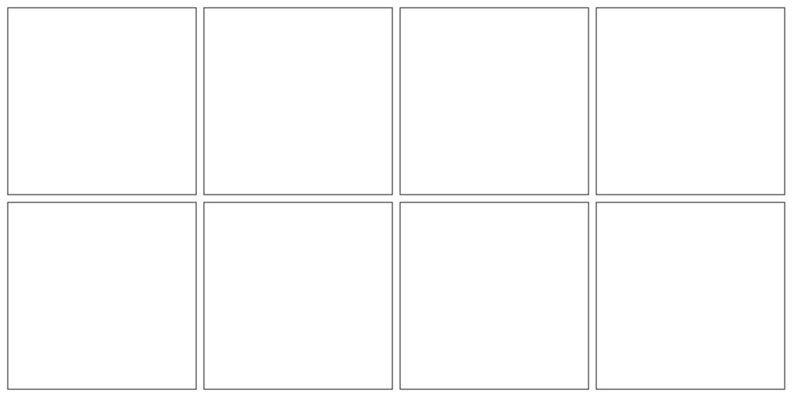

# grid-cells

[](http://github.com/badges/stability-badges)

Computes grid cells coordinates



## Usage

[](https://www.npmjs.com/package/grid-cells)

#### grid(width, height, numCellsX, numCellsY, margin)

Returns: List of numCellsX * numCellsY rectangles. `[[x, y, w, h], ...]`

## Example

To get a grid like in the screenshot above

```javascript
var grid = require('grid-cells');

var cells = grid(1024, 512, 4, 2, 10);
console.log(cells[0]); //-> [ 10, 10, 243, 241 ]

```

## License

MIT, see [LICENSE.md](http://github.com/vorg/grid-cells/blob/master/LICENSE.md) for details.
